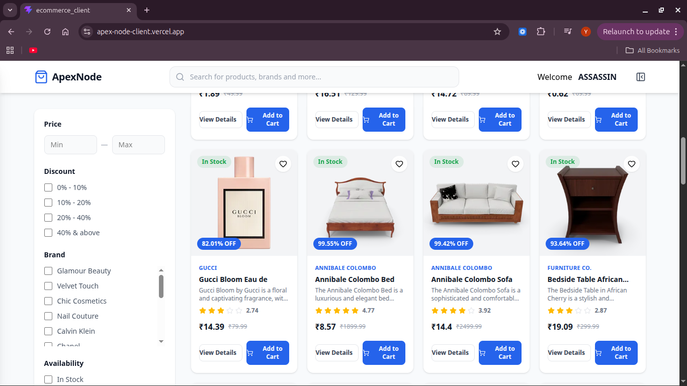
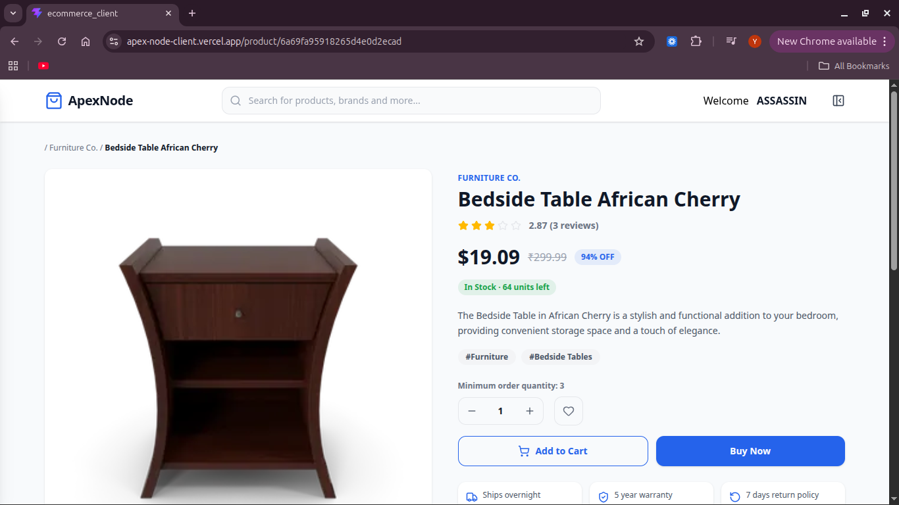
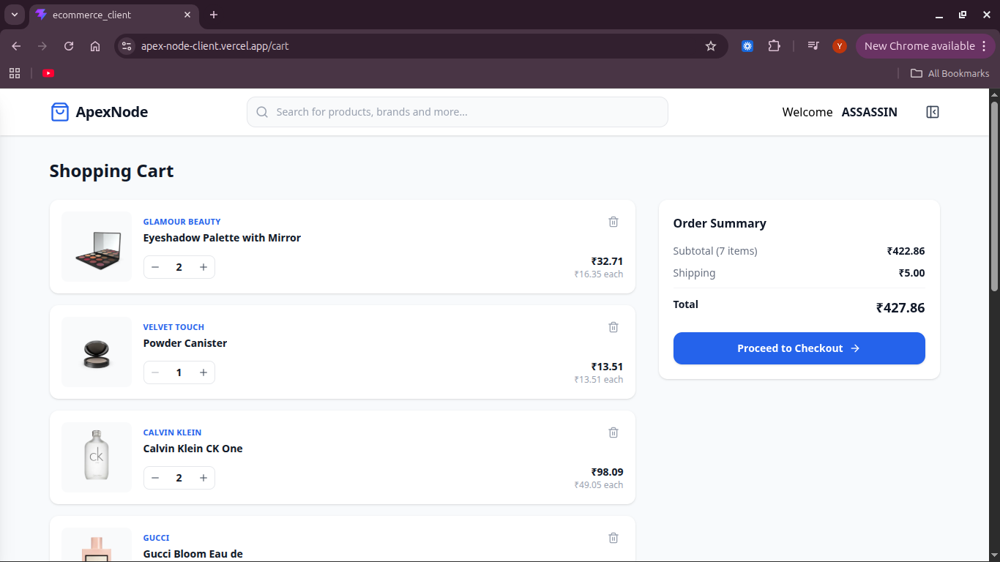
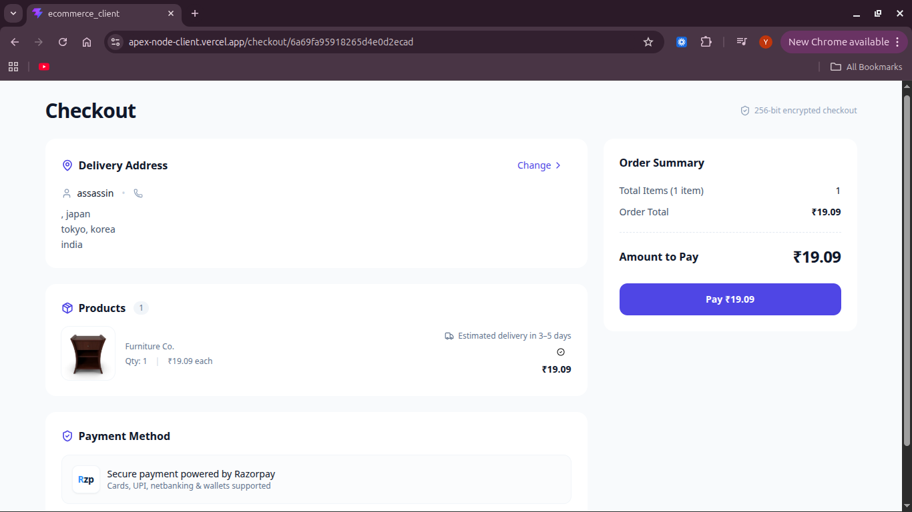
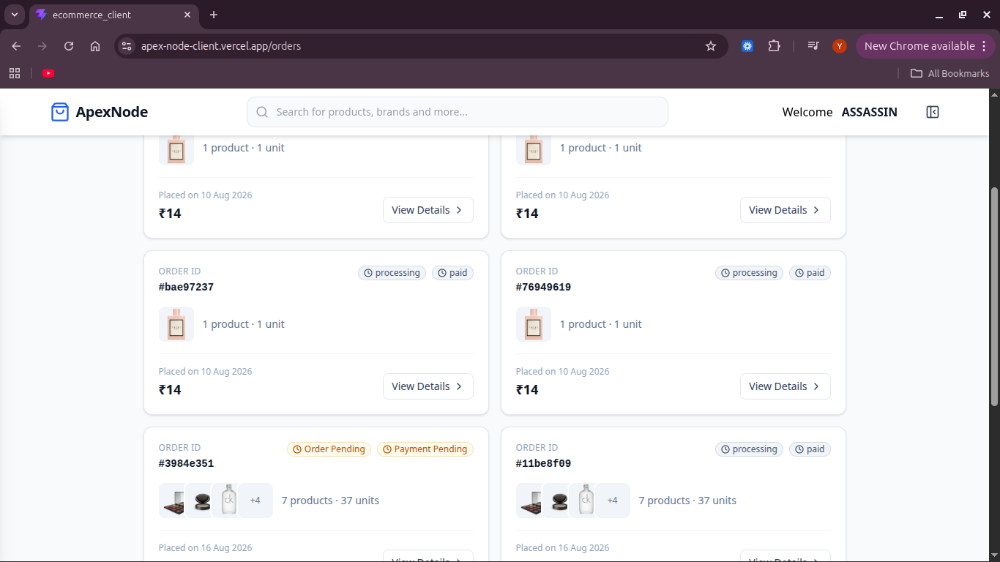
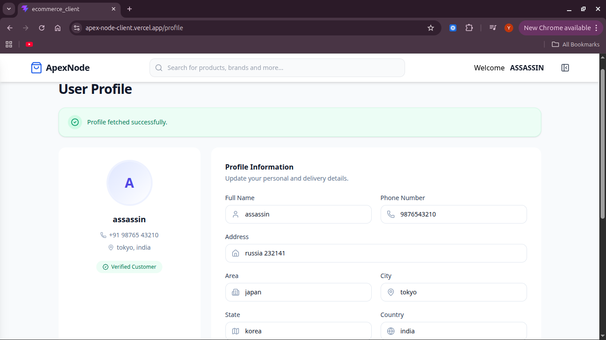
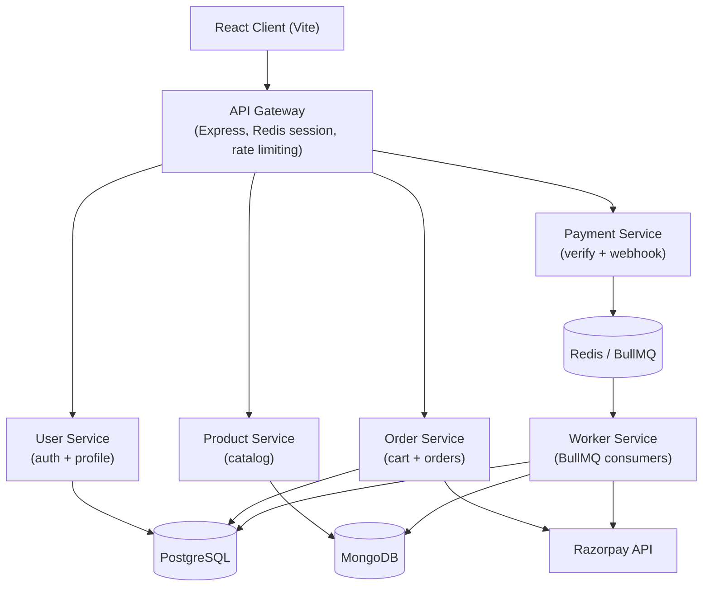
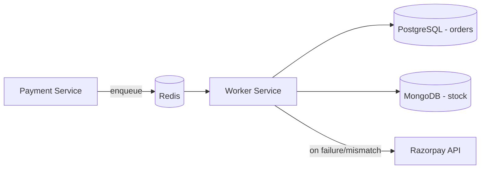

# ApexNode

**ApexNode** is a full-stack e-commerce application built with a React client and a microservice-oriented Node.js backend — featuring an API Gateway, independent services for users, products, orders, and payments, and a dedicated background worker for asynchronous order/payment processing.

---

## 🚀 Quick Access

|                     |                                                             |
| ------------------- | ----------------------------------------------------------- |
| 🖥️ **Frontend**    | [ApexNode Live App](https://apexnode-client.onrender.com)   |
| 📘 **Backend Docs** | [server/README.md](server/README.md)                        |
| 💻 **Repository**   | [GitHub Repository](https://github.com/TrainedDev/ApexNode) |

> ⚠️ **Free-Tier Deployment Notice**
>
> ApexNode is currently deployed using **Render's free-tier infrastructure**. The application consists of multiple independently deployed microservices, and free-tier services may **sleep after periods of inactivity**.
>
> Because of this, the live application may occasionally experience:
>
> * 🕐 **Slow initial responses** while services wake up
> * ⚠️ **Temporary 502/503 errors** during cold starts
> * 🔄 Delays when multiple microservices need to wake up
>
> The client includes retry and server-wakeup handling, but cold starts can still occasionally cause temporary failures.
>
> **For the most reliable experience, especially if the live application is temporarily unavailable, please run the project locally using the setup instructions below.**

### 💳 Razorpay Test Payment

The checkout uses **Razorpay Test Mode**, so no real payment is required.

**Test Card**

* **Card Number:** `4100 2800 0000 1007`
* **Expiry:** Any valid future date
* **CVV:** Any 3-digit security code

> ℹ️ These credentials are for Razorpay's sandbox/test environment only and do not perform real transactions.

### How to Try the Live Application

1. Open the [ApexNode Live App](https://apexnode-client.onrender.com).
2. Register a new account or log in.
3. Browse the product catalog on the home page.
4. Open a product to view its details.
5. Add products to your cart.
6. Go to checkout and enter your delivery address.
7. Complete payment using the Razorpay test card above.
8. View your order history and update your profile.

> **If the live application is temporarily unavailable:** Wait a short while and retry, or run the project locally using the **Local Development** instructions below.

---

## ✨ Features

* **Authentication** — register, login, logout, and session-status check
* **Product browsing** — paginated and filterable product catalog
* **Product details** — individual product view
* **Cart** — add, update quantity, remove, and clear cart items (max 10 items)
* **Checkout** — address entry and order summary
* **Payments** — Razorpay-based checkout with server-side signature verification
* **Orders** — order history and order status tracking
* **Profile** — create, view, and update a delivery/user profile

---

## 📸 Screenshots

> The screenshots below are referenced from `docs/screenshots/`. Add the corresponding image files to that folder to display them here.

<p>
  
</p>

<p>
  
</p>

<p>
  
</p>

<p>
  
</p>

<p>
  
</p>

<p>
  
</p>

---

## 🏗️ Architecture



* **API Gateway** is the single entry point for the client. It manages the user's session backed by Redis, attaches an `x-user-id` header to downstream requests, applies per-route rate limiting, and reverse-proxies requests to the appropriate microservice.
* **The client never communicates with a microservice directly** — every backend request goes through the API Gateway at `/api/v1/*`.
* Each microservice owns its own routes, business logic, and data store and is independently deployable.
* **Asynchronous work** such as stock updates, order status changes, refunds, and payment reconciliation is handled by a dedicated **Worker** service that consumes BullMQ jobs from Redis rather than processing these operations directly inside the request/response cycle.
* **Razorpay** is integrated for payment order creation, client-side checkout, signature verification, webhooks, refunds, and payment reconciliation.

---

## 🧩 Services

| Component           | Responsibility                                                                     |
| ------------------- | ---------------------------------------------------------------------------------- |
| **Client**          | React SPA — product browsing, cart, checkout, orders, profile                      |
| **API Gateway**     | Session management, authentication propagation, rate limiting, request routing     |
| **User Service**    | Registration, login/logout, session status, user profile                           |
| **Product Service** | Product catalog CRUD and product lookups                                           |
| **Order Service**   | Cart management and order creation, including Razorpay order creation              |
| **Payment Service** | Payment verification, Razorpay webhook handling, and job enqueueing                |
| **Worker**          | Background processing for stock updates, order status, refunds, and reconciliation |

---

## 🔄 Request Flow

### Browsing Products

```text
Client
  ↓
GET /api/v1/inventory/products
  ↓
API Gateway
  ↓
Product Service
  ↓
MongoDB
  ↓
JSON Response
```

### Placing an Order and Paying

1. `Client → POST /api/v1/checkout/orders → API Gateway`
   The gateway injects the authenticated user's `x-user-id` before forwarding the request to the Order Service.

2. **Order Service** creates a Razorpay order and stores the local order and order-items records in PostgreSQL.

3. The client opens the Razorpay checkout widget using the returned Razorpay order ID and key.

4. After successful payment, the client calls `POST /api/v1/payment/verify`.

5. **Payment Service** verifies the HMAC signature and enqueues the payment-processing job in Redis through BullMQ. Razorpay's webhook provides an additional server-to-server confirmation path.

6. The **Worker** processes the job, updates product stock in MongoDB, updates the order/payment status in PostgreSQL, and triggers a refund job if stock is insufficient.

---

## 💳 Payment Flow

1. **Order Creation** — Order Service creates a Razorpay order using `razorpayInstance.orders.create()` alongside a local `pending` order/order-items record.

2. **Client Checkout** — The client loads Razorpay Checkout.js and opens the payment widget using the returned order ID and key.

3. **Payment Verification** — After successful payment, the client sends the Razorpay payment ID, order ID, and signature to Payment Service. The service recomputes the HMAC-SHA256 signature and compares it with the signature returned by Razorpay.

4. **Webhook Backup Path** — Razorpay also calls `POST /api/v1/payment/razorpay-webhook` directly. The webhook is verified using a separate webhook secret and provides an additional confirmation path if client-side verification fails or is skipped.

5. **Payment Reconciliation** — If verification fails or a payment state cannot be reliably confirmed, a reconciliation job is queued. The Worker fetches the actual payment status from Razorpay and re-drives the appropriate payment flow.

6. **Background Settlement** — The Worker updates order/payment status and, when payment is captured, decrements product stock. If stock is unavailable, a refund job is automatically queued.

---

## ⚙️ Background Jobs

Background processing is built using **BullMQ + Redis**, with four queues:

* `paymentQueue`
* `refundQueue`
* `reconcilePaymentQueue`
* `initiatePaymentQueue`

Jobs use exponential backoff with up to 3 retry attempts.



Implementation details including queue names, processors, and retry configuration are covered in [server/README.md](server/README.md).

---

## 🛠️ Tech Stack

### Frontend

React 19 · Vite · React Router v7 · Redux Toolkit / React-Redux · Tailwind CSS v4 · Axios · React Hook Form · Razorpay Checkout.js

### Backend

Node.js · Express 5 · Sequelize (PostgreSQL) · Mongoose (MongoDB) · `http-proxy-middleware` · `express-session` + `connect-redis`

### Infrastructure

PostgreSQL · MongoDB · Redis · BullMQ

### External Services

Razorpay — payments, webhooks, refunds, and reconciliation

---

## 📁 Project Structure

```text
ApexNode/

├── Client/                    # React (Vite) frontend
│
├── server/
│   ├── apiGateway/            # Express reverse proxy, sessions, rate limiting
│   │
│   └── services/
│       ├── userService/       # Auth + profile (PostgreSQL)
│       ├── productService/    # Product catalog (MongoDB)
│       ├── orderService/      # Cart + orders (PostgreSQL, Razorpay orders)
│       ├── paymentService/    # Payment verification + webhook (Redis/BullMQ)
│       └── workers/           # Background job processors
│
├── docs/
│   └── screenshots/            # README screenshots
│
└── README.md
```

---

## ⚙️ Local Development

There is no root-level package manager or workspace configuration. Each application/service is installed and run independently.

### Prerequisites

* Node.js
* PostgreSQL database
* MongoDB database
* Redis instance
* Razorpay test account with:

  * Key ID
  * Key Secret
  * Webhook Secret

### Clone

```bash
git clone https://github.com/TrainedDev/ApexNode.git

cd ApexNode
```

### Install & Run Each Service

```bash
# Client
cd Client
npm install
npm run dev

# API Gateway
cd server/apiGateway
npm install
npm run dev

# User Service
cd server/services/userService
npm install
npm run dev

# Product Service
cd server/services/productService
npm install
npm run dev

# Order Service
cd server/services/orderService
npm install
npm run dev

# Payment Service
cd server/services/paymentService
npm install
npm run dev

# Worker
cd server/services/workers
npm install
npm run dev
```

Each service requires its own `.env` file. The User, Order, and Worker services also require the appropriate PostgreSQL migrations to be run using `sequelize-cli`.

---

## 🔐 Environment Variables

No `.env.example` files are committed. Configure these variables for each service using placeholders only. **Never commit real credentials or secrets.**

| Service             | Variables                                                                                                                  |
| ------------------- | -------------------------------------------------------------------------------------------------------------------------- |
| **Client**          | `VITE_API_URL`                                                                                                             |
| **API Gateway**     | `PORT`, `CLIENT_URL`, `SESSION_SECRET`, `REDIS_URL`, `USER_SERVICE`, `PRODUCT_SERVICE`, `ORDER_SERVICE`, `PAYMENT_SERVICE` |
| **User Service**    | `PORT`, `DB_URL`                                                                                                           |
| **Product Service** | `PORT`, `MONGO_URI`                                                                                                        |
| **Order Service**   | `PORT`, `DB_URL`, `RAZORPAY_TEST_KEY`, `RAZORPAY_TEST_SECRET_KEY`                                                          |
| **Payment Service** | `PORT`, `IOREDIS_HOST`, `RAZORPAY_TEST_SECRET_KEY`, `RAZORPAY_TEST_WEBHOOK_SECRET_KEY`                                     |
| **Worker**          | `PORT`, `DB_URL`, `MONGO_URI`, `IOREDIS_HOST`, `RAZORPAY_TEST_KEY`, `RAZORPAY_TEST_SECRET_KEY`                             |

---

## 🚀 Deployment

The application is deployed as independently hosted services. The frontend includes a `vercel.json`, while the backend services expose `/health` endpoints and are deployed using Render's free-tier infrastructure.

### Free-Tier Deployment Behavior

Render's free-tier services may **spin down after periods of inactivity**. When a sleeping service receives a request, it needs time to start again.

Because ApexNode consists of multiple microservices, a request may need to wait for more than one service to become available.

The application therefore includes **retry and server-wakeup handling** to improve the experience during cold starts.

> ⚠️ **Important:** The live deployment is intended primarily as a demonstration environment. **Slow responses and occasional 502/503 errors are possible**, particularly after inactivity or when multiple services need to wake up simultaneously.
>
> If the live application is temporarily unavailable, please wait and retry, or use the **Local Development** setup for the most reliable experience.

---

## ⚠️ Known Limitations

### Cold Starts

The application uses Render's free-tier infrastructure, where services may sleep after inactivity.

As a result:

* The first request can be significantly slower.
* Multiple microservices may need to wake up independently.
* Temporary `502`/`503` responses may occur during cold starts.
* The client includes retry and server-wakeup handling, but a cold start can still occasionally exceed the retry window.

### No Automated Tests

`jest` is included as a development dependency in several services, but automated test files are not currently included in the repository.

### No Containerization or CI/CD

Services are currently run and deployed individually rather than using Docker/container orchestration or an automated CI/CD pipeline.

### External Service Dependencies

The application depends on PostgreSQL, MongoDB, Redis, and Razorpay. These services must be configured correctly for the complete application to function locally.

---

## 🔮 Future Improvements

* Docker/containerization for local and production parity
* CI/CD pipeline for automated builds and deployments
* Centralized logging and observability/monitoring
* Automated unit and integration test coverage
* Production-grade infrastructure without cold-start limitations
* Improved service health monitoring and recovery
* Enhanced distributed tracing across microservices

---

## 📄 License

This repository currently has no license file or specified open-source license.
