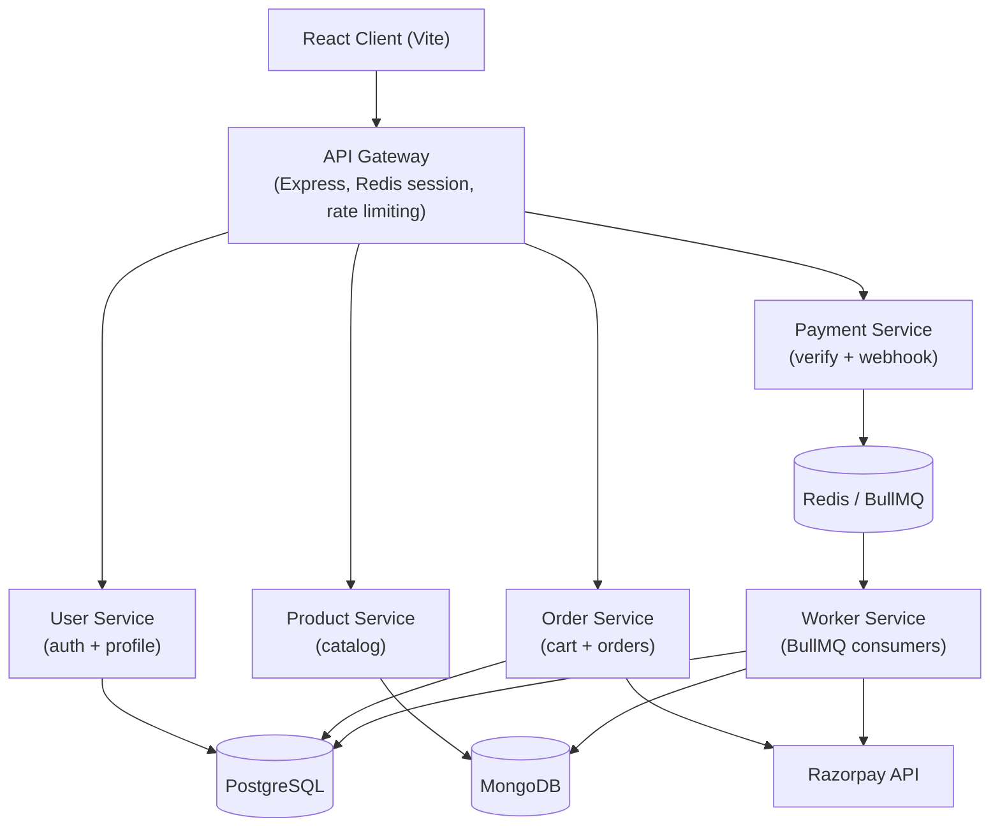
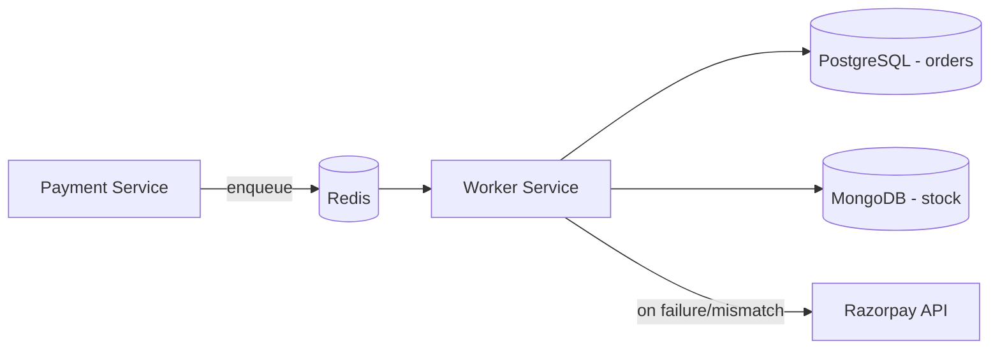

# ApexNode

**ApexNode** is a full-stack e-commerce application built with a React client and a microservice-oriented Node.js backend — featuring an API Gateway, independent services for users, products, orders, and payments, and a dedicated background worker for asynchronous order/payment processing.

---

## 🚀 Quick Access

| | |
|---|---|
| 🖥️ **Frontend** | [apexnode-client.onrender.com](https://apex-node-client.vercel.app) *(hosted on a free tier — see note below)* |
| 📘 **Backend docs** | [server/README.md](server/README.md) |
| 💻 **Repository** | [github.com/TrainedDev/ApexNode](https://github.com/TrainedDev/ApexNode) |

> ⚠️ **Free-tier notice:** The frontend and backend are hosted on free-tier infrastructure that sleeps after inactivity. The first request after idle time may take a few extra seconds while services wake up — the app shows a "Server is waking up" notice during this window.

### How to try it

1. Open the live frontend link above.
2. Register a new account or log in.
3. Browse the product catalog on the home page.
4. Open a product to view its details.
5. Add products to your cart.
6. Go to checkout and enter your delivery address.
7. Complete payment via the Razorpay checkout popup.
8. View your order history and update your profile.

---

## ✨ Features

- **Authentication** — register, login, logout, and session-status check
- **Product browsing** — paginated/filterable product catalog
- **Product details** — individual product view
- **Cart** — add, update quantity, remove, and clear cart items (max 10 items)
- **Checkout** — address entry and order summary
- **Payments** — Razorpay-based checkout with server-side signature verification
- **Orders** — order history and order status tracking
- **Profile** — create, view, and update a delivery/user profile

---

## 📸 Screenshots

> The screenshots below are referenced from `docs/screenshots/` — add the corresponding image files to that folder to display them here.

<p>
  
</p>
<p>
  
</p>
<p>
  
</p>
<p>
  
</p>
<p>
  
</p>
<p>
  
</p>
<p>
  
</p>

---

## 🏗️ Architecture



- **API Gateway** is the single entry point for the client. It terminates the user's session (backed by Redis), attaches an `x-user-id` header to downstream requests, applies per-route rate limiting, and reverse-proxies requests to the correct microservice.
- **The client never talks to a microservice directly** — every request goes through the gateway at `/api/v1/*`.
- Each microservice owns its own routes, business logic, and data store, and is otherwise independent of the others.
- **Asynchronous work** (updating stock, order status, refunds, and payment reconciliation) is handled by a separate **Worker** service that consumes BullMQ jobs from Redis rather than doing this work inline in the request/response cycle.
- **Razorpay** is integrated for payment order creation, client-side checkout, signature verification, webhooks, and refunds.

---

## 🧩 Services

| Component | Responsibility |
|---|---|
| **Client** | React SPA — product browsing, cart, checkout, orders, profile |
| **API Gateway** | Session management, auth propagation, rate limiting, request routing |
| **User Service** | Registration, login/logout, session status, user profile |
| **Product Service** | Product catalog CRUD and cart product lookups |
| **Order Service** | Cart management and order creation (incl. Razorpay order creation) |
| **Payment Service** | Payment verification, Razorpay webhook handling, job enqueueing |
| **Worker** | Background processing: stock updates, order status, refunds, reconciliation |

---

## 🔄 Request Flow

**Browsing products:**
`Client → GET /api/v1/inventory/products → API Gateway → Product Service → MongoDB → JSON response`

**Placing an order and paying:**
1. `Client → POST /api/v1/checkout/orders → API Gateway` (injects `x-user-id` from the session) `→ Order Service`
2. Order Service creates a Razorpay order and stores the order + items in PostgreSQL, returning the Razorpay order ID and key.
3. The client opens the Razorpay checkout widget and, on success, calls `POST /api/v1/payment/verify`.
4. Payment Service verifies the HMAC signature and enqueues a job on Redis via BullMQ (Razorpay's webhook is also handled as a redundant, server-to-server confirmation path).
5. The Worker service picks up the job, decrements product stock in MongoDB, and updates the order status in PostgreSQL — triggering an automatic refund job if stock is insufficient.

---

## 💳 Payment Flow

1. **Order creation** — Order Service creates a Razorpay order (`razorpayInstance.orders.create`) alongside a local `pending` order/order-items record.
2. **Client checkout** — the client loads Razorpay's checkout script and opens the payment widget using the returned order ID and key.
3. **Verification** — on success, the client sends the Razorpay payment ID, order ID, and signature to Payment Service, which recomputes an HMAC-SHA256 signature and compares it against the one returned by Razorpay.
4. **Webhook (backup path)** — Razorpay also calls `POST /api/v1/payment/razorpay-webhook` directly, verified against a separate webhook secret, as a fallback if the client-side verification call fails or is skipped.
5. **Reconciliation** — if a signature check fails, a reconciliation job is queued; the Worker fetches the real payment status from Razorpay and re-drives the payment flow.
6. **Background settlement** — the Worker updates order/payment status and, on `payment.captured`, decrements stock; if stock is unavailable it automatically enqueues a refund job.

---

## ⚙️ Background Jobs

Background processing is built on **BullMQ + Redis**, with four queues: `paymentQueue`, `refundQueue`, `reconcilePaymentQueue`, and `initiatePaymentQueue`. Jobs use exponential backoff with up to 3 retry attempts.



Implementation details (queue names, processors, retry config) are covered in [server/README.md](server/README.md).

---

## 🛠️ Tech Stack

### Frontend
React 19 · Vite · React Router v7 · Redux Toolkit / React-Redux · Tailwind CSS v4 · Axios · React Hook Form · Razorpay Checkout.js

### Backend
Node.js · Express 5 · Sequelize (PostgreSQL) · Mongoose (MongoDB) · `http-proxy-middleware` · `express-session` + `connect-redis`

### Infrastructure
PostgreSQL · MongoDB · Redis · BullMQ

### External Services
Razorpay (payments, webhooks, refunds)

---

## 📁 Project Structure

```
ApexNode/
├── Client/                # React (Vite) frontend
├── server/
│   ├── apiGateway/        # Express reverse proxy, sessions, rate limiting
│   └── services/
│       ├── userService/       # Auth + profile (PostgreSQL)
│       ├── productService/    # Product catalog (MongoDB)
│       ├── orderService/      # Cart + orders (PostgreSQL, Razorpay orders)
│       ├── paymentService/    # Payment verification + webhook (Redis/BullMQ)
│       └── workers/           # Background job processors
├── docs/
│   └── screenshots/       # README screenshots (see note above)
└── README.md
```

---

## ⚙️ Local Development

There is no root-level package manager/workspace config — each app is installed and run independently.

### Prerequisites
- Node.js
- A PostgreSQL database
- A MongoDB database
- A Redis instance
- A Razorpay test account (key ID, key secret, webhook secret)

### Clone

```bash
git clone https://github.com/TrainedDev/ApexNode.git
cd ApexNode
```

### Install & run each service

```bash
# Client
cd Client && npm install && npm run dev

# API Gateway
cd server/apiGateway && npm install && npm run dev

# User Service
cd server/services/userService && npm install && npm run dev

# Product Service
cd server/services/productService && npm install && npm run dev

# Order Service
cd server/services/orderService && npm install && npm run dev

# Payment Service
cd server/services/paymentService && npm install && npm run dev

# Worker
cd server/services/workers && npm install && npm run dev
```

Each service needs its own `.env` file (see below) and, for the User/Order/Worker services, its PostgreSQL migrations run via `sequelize-cli`.

---

## 🔐 Environment Variables

No `.env.example` files are committed. Set these per service (placeholders only — never commit real values):

| Service | Variables |
|---|---|
| Client | `VITE_API_URL` |
| API Gateway | `PORT`, `CLIENT_URL`, `SESSION_SECRET`, `REDIS_URL`, `USER_SERVICE`, `PRODUCT_SERVICE`, `ORDER_SERVICE`, `PAYMENT_SERVICE` |
| User Service | `PORT`, `DB_URL` |
| Product Service | `PORT`, `MONGO_URI` |
| Order Service | `PORT`, `DB_URL`, `RAZORPAY_TEST_KEY`, `RAZORPAY_TEST_SECRET_KEY` |
| Payment Service | `PORT`, `IOREDIS_HOST`, `RAZORPAY_TEST_SECRET_KEY`, `RAZORPAY_TEST_WEBHOOK_SECRET_KEY` |
| Worker | `PORT`, `DB_URL`, `MONGO_URI`, `IOREDIS_HOST`, `RAZORPAY_TEST_KEY`, `RAZORPAY_TEST_SECRET_KEY` |

---

## 🚀 Deployment

The client includes a `vercel.json`, and backend services expose `/health` endpoints with references to Render in their code comments — indicating the backend (and possibly the client) is deployed on free-tier, sleep-based hosting.

> ⚠️ Free-tier deployment notice: Some services may experience cold starts or temporary delays after periods of inactivity. The first request after inactivity may take longer than subsequent requests.

---

## ⚠️ Known Limitations

- **Cold starts** — free-tier hosting causes the first request after inactivity to be slow; the client includes retry logic and a "waking up" notice to compensate.
- **No automated tests** — `jest` is listed as a dev dependency in several services, but no test files currently exist in the repository.
- **No containerization or CI/CD** — services are run and deployed individually rather than through Docker or an automated pipeline.

---

## 🔮 Future Improvements

- Docker/containerization for local and production parity
- CI/CD pipeline for automated builds and deploys
- Centralized logging and observability/monitoring
- Automated test coverage (unit/integration)
- Production-grade infrastructure without cold-start limitations

---

## 📄 License

This repository currently has no license file / specified license.